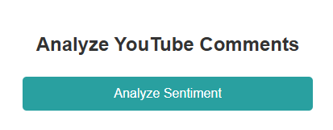
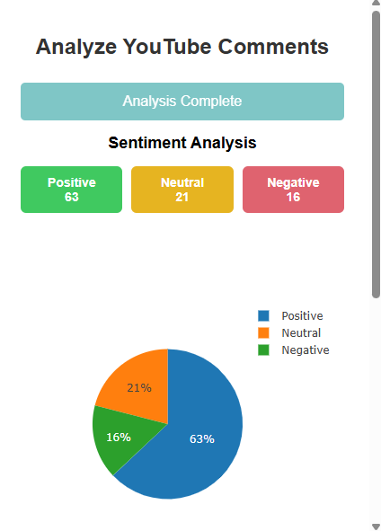
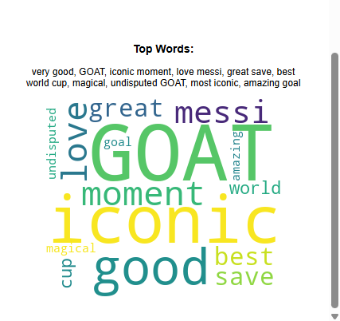

## YouTube Sentiment Analysis Chrome Extension

Analyze YouTube video comments instantly with sentiment insights! This Chrome extension fetches comments from a video, analyzes their sentiment using AI, and provides a pie chart, sentiment counts, and a word cloud for better understanding. 

We have utilized **Groq**, which offers AI inference as a service, allowing us to leverage powerful AI models for sentiment analysis. The sentiment analysis is powered by an open-source model available through Groq’s API, providing accurate and efficient sentiment classification for YouTube comments.

### ✨ Features

- ✅ Fetches YouTube comments from the currently open video
- ✅ Uses AI sentiment analysis to classify comments as Positive, Neutral, or Negative
- ✅ Displays a pie chart for sentiment distribution
- ✅ Shows the most common sentiment-related phrases
- ✅ Generates a word cloud for frequently used words

### 🚀 Technologies Used

- Flask (Backend API)

- Groq AI (Llama 3.3-70B-Versatile) (Sentiment Analysis)

- YouTube Data API (Fetching comments)

- Plotly.js (Visualizing sentiment distribution)

- JavaScript (Chrome Extension Development)

- HTML & CSS (Popup UI)

### 📸 Screenshots  

#### **1️⃣ Extension Popup UI**

#### **2️⃣ Sentiment Analysis Results**

#### **3️⃣ Word Cloud & Pie Chart**

